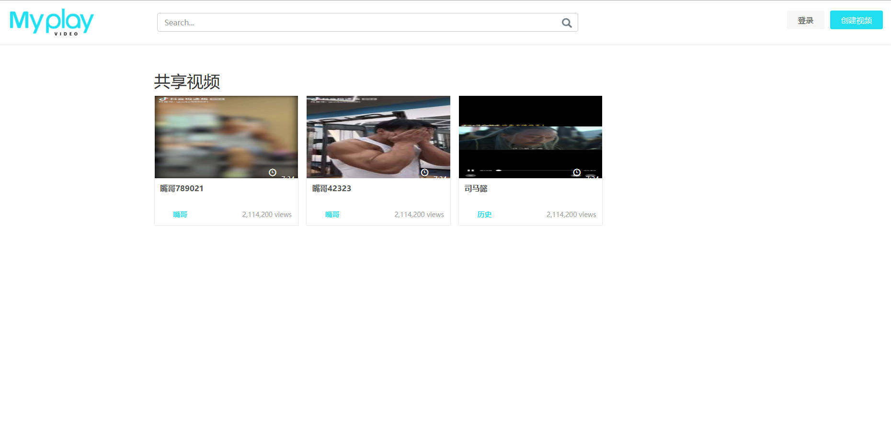
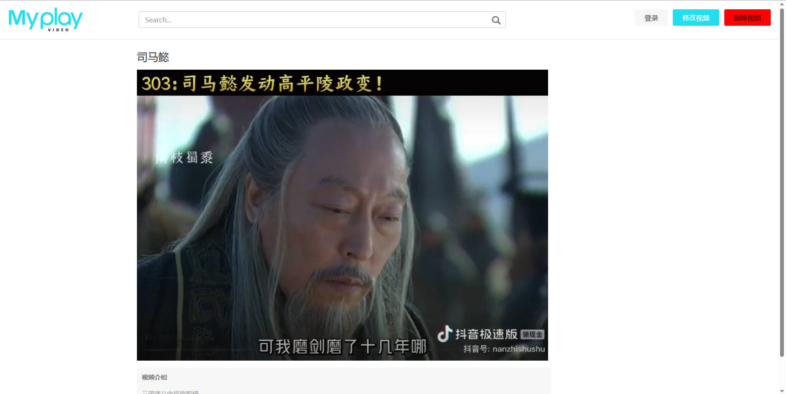

## 项目展示

## 项目总结

#### 项目名称：

视频共享点播系统

### 项目功能：

搭建一个共享点播系统，服务器支持用户通过前端浏览器访问服务器，获取展示与观看和操作的界面，最
终实现视频的上传以及观看和删改查等基础管理功能。

### 开发环境：

centos7.6/vim、g++7.3、gdb、makefile、 mysql

环境搭建可以参考我的上一个项目 

[boost搜索引擎]:https://github.com/YellowSkate/BoostSearcher

### 技术特点：

http服务器搭建，mysql数据管理，restful风格接口设计，json序列化，线程池，html+css+js基础

### 项目模块：

数据管理模块：基于MYSQL进行数据管理，封装数据管理类进行数据统一访问
业务处理模块：基于HTTPLIB搭建HTTP服务器，使用restful风格进行接口设计处理客户端业务请求
前端界面模块：基于基础的HTML+CSS+JS完成基于简单模板前端界面的修改与功能完成。

### 项目开发过程:

参考我的博客：http://t.csdn.cn/Tk3ag

## QQ:859440223

## WeChat:iIl1o0OI
